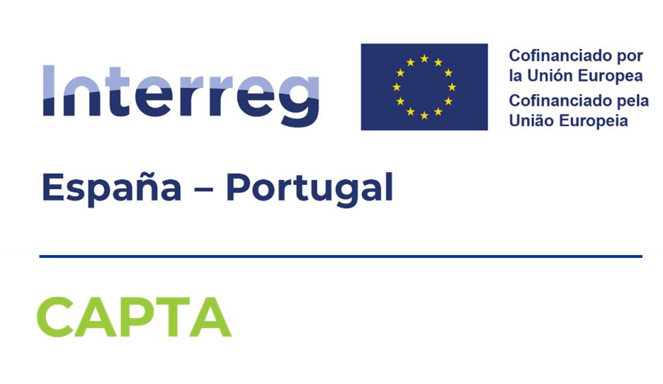

# API_QUERY: Oceanographic Monitoring API Clients

Developed at INTECMAR by Pedro Montero.

## 📌 Overview
This repository contains a suite of professional Python tools designed to interact with the OCXG Oceanographic API. It is organized into several modules, each specializing in a specific monitoring network or data type.

## 📂 Modules

### 1. [🌊 CTD](CTD/)
A module for retrieving, processing, and visualizing vertical profiles from CTD stations.
- **Status**: Production Ready.
- **Features**: Excel export, professional profile plotting (Seaborn), quality flag handling, and 2D heatmaps.

### 2. [⚓ MOORINGS](MOORINGS/)
A module for fixed oceanographic platforms and moorings time series.
- **Status**: Production Ready.
- **Features**: Multi-depth time series plots, Excel data export, quality flag filtering, and automatic parameter resolution.

### 3. [🦀 REDECOS](REDECOS/)
A module for the Coastal Oceanographic Network (Rede de Observación Costeira).
- **Status**: Production Ready.
- **Features**: Multi-station parameter export to Excel, professional time series plotting, automated parameter resolution, and quality flag handling.

## 🚀 Getting Started
Each module is self-contained and may have its own requirements and configuration files. Please refer to the specific `README.md` within each directory for detailed setup instructions.

### Prerequisites
- Python 3.8+
- Git

## 📜 License
This repository is licensed under the MIT License - see the [CTD/LICENSE](CTD/LICENSE) file for details.

---

  

**ES:** Cofinanciado por la Unión Europea a través del Programa Interreg VI-A España-Portugal (POCTEP) 2021-2027. Las opiniones son de exclusiva responsabilidad del autor que las emite.

**PT:** Cofinanciado pela União Europea através do Programa Interreg VI-A Espanha-Portugal (POCTEP) 2021-2027. As opiniões expressas são da exclusiva responsabilidade do autor.

**EN:** Co-funded by the European Union through the Interreg VI-A Spain-Portugal (POCTEP) 2021-2027 Program. The opinions expressed are the sole responsibility of the author.
