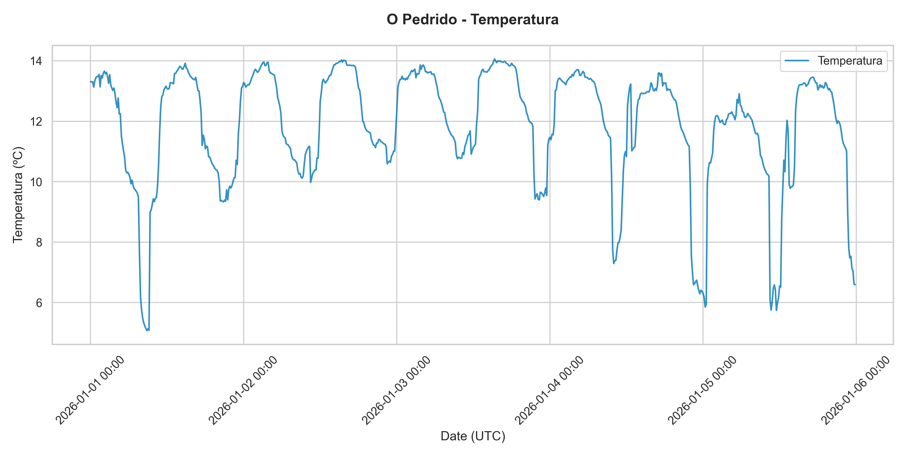

# Redecos_query: Coastal Observation Network Tool

Developed for INTECMAR by Pedro Montero.

## 🌊 Overview
This module handles **REDECOS data** (Coastal Observation Network). It retrieves historical measurements from sensors deployed along the coast (e.g., at Pedrido, Arcade, Lombos do Ulla).

## 📁 Structure
- **`src/`**: Main toolkit (client, processor, models, visualization).
- **`plots/`**: Generated time-series charts (PNG).
- **`output/`**: Multi-parameter Excel reports (XLSX).

## 🚀 Usage

### ⚙️ 1. Setup
Make sure you have your `.env` file in the `REDECOS/` folder (or the root) with:
```env
API_USER=your_user
API_PASSWORD=your_password
API_BASE_URL=https://api.intecmar.gal
```

### 📋 2. Execution
Run the main script to process both plots and excel reports:
```bash
python run_redecos.py
```

## 🛠️ Configuration
Edit the configuration files to customize results:

- **`input.json`**:
```json
{
    "begin_date": "2026-01-01",
    "end_date": "2026-01-05",
    "stations": ["GB", "AR", "LO"],
    "variables": ["Temperatura", "Salinidade"]
}
```

- **Filtering**: Like the CTD and Mooring modules, data with **ValidationCode 9** is automatically excluded from result files.

## 📉 Features
- **Integrated Analysis**: Automatically pulls parameters and station metadata to resolve names and units.
- **Excel per Station**: Each station gets a single file with columns for all requested variables, correctly aligned by time.

## 🎨 Visualization Example
Example of a Coastal Observation Network time-series generated by the module:


